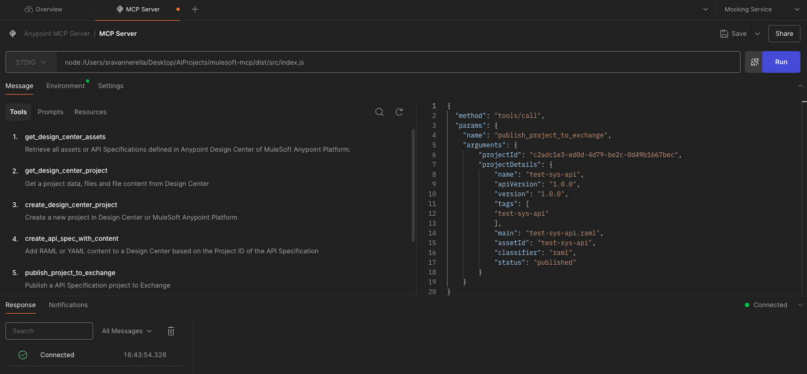

# MuleSoft Design Center MCP Server

What if you can interact with MuleSoft Design Center via Natural Language - like Create and Manage API Specifications. That's exactly what this MCP server does.

## ✨ Features

- Get Design Center Projects
- Get API Specification
- Create / Update API Specification
- Publish Project to Exchange
- Get API Manager Environments

## 🚀 Getting Started

### Prerequisites
- Node.js 18+
- Anypoint Platform credentials

### Step by Step Guide
1) Clone the repository
2) Install the dependencies
```bash
    npm install
```
3) Add .env file with the following variables:
```bash
    ANYPOINT_CLIENT_ID=YOUR_ANYPOINT_CLIENT_ID
    ANYPOINT_CLIENT_SECRET=YOUR_ANYPOINT_CLIENT_SECRET
```
4) Build the project and run the MCP Server
```bash
    npm run build
    npm run dev
```

## 🧠 Configuration With Cursor

- Navigate to the Cursor MCP Server Settings
- Add the following:
```json
{
    "design-center-mcp": {
      "command": "node",
      "args": ["PATH_TO_MCP_SERVER/dist/src/index.js"],
      "env": {
        "ANYPOINT_CLIENT_ID": "YOUR_ANYPOINT_CLIENT_ID",
        "ANYPOINT_CLIENT_SECRET": "YOUR_ANYPOINT_CLIENT_SECRET"
      }
    }
}
```

### 📦 Running with Postman

1) Download the latest Postman application with MCP Support from [here](https://www.postman.com/downloads/)
2) Open Postman and Create a new MCP Collection
3) In the URL field, enter the following and provide your `ANYPOINT_CLIENT_ID` and `ANYPOINT_CLIENT_SECRET` as environment variables
```
    node PATH_TO_MCP_SERVER/dist/src/index.js
```
4) Click on the "Connect" button to test the connection
5) You should see tools and methods available for the MCP Server
6) Click on selected tool and provide the required parameters
7) Click on the "Run" button to execute the request
8) You should see the response from the MCP Server

### 📝 Postman MCP Server Configuration


## 📫 Feedback or Issues?
Feel free to open an issue or pull request in this repo. We welcome contributions!
